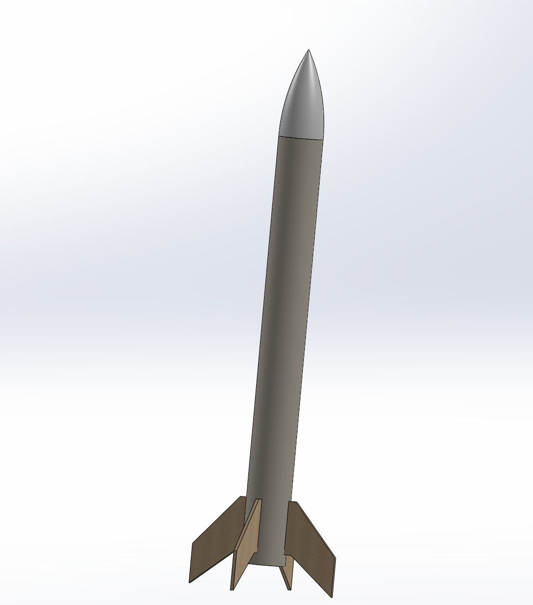
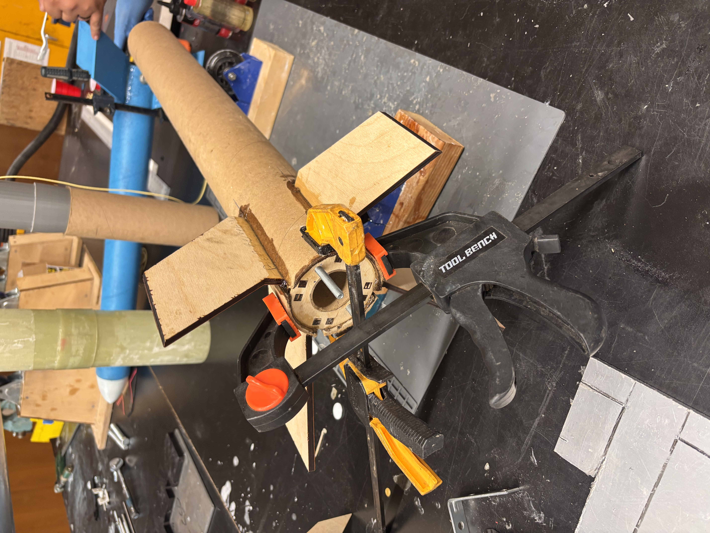
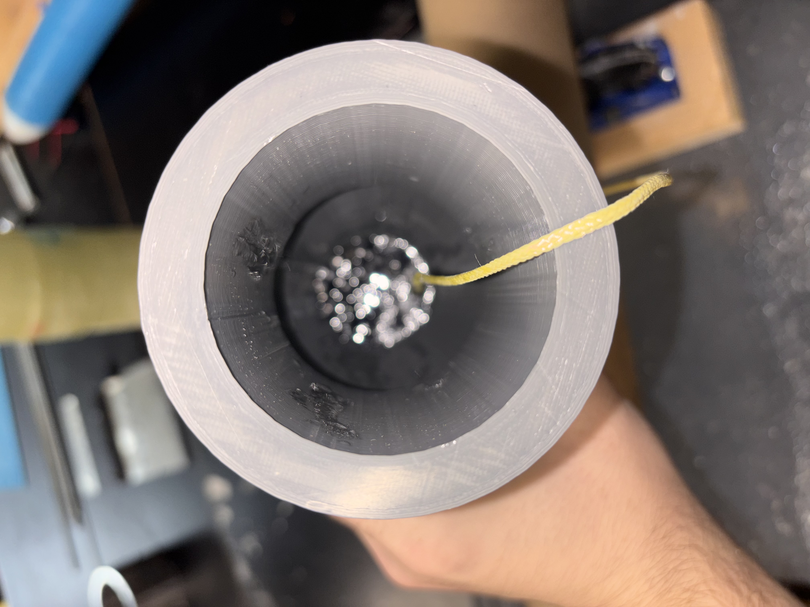
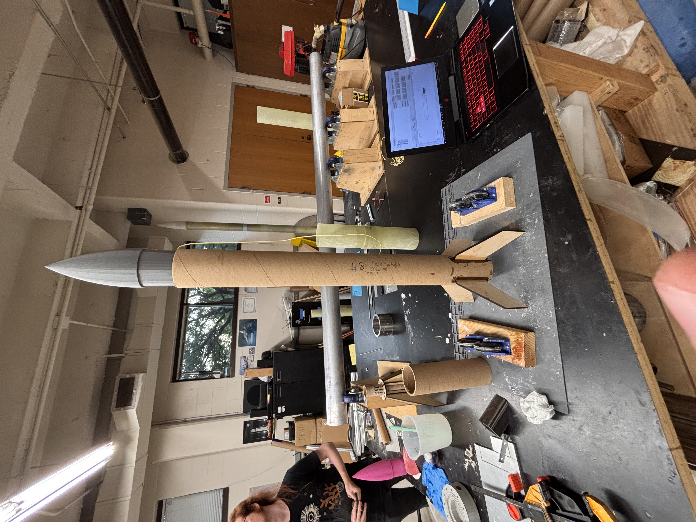

High powered amateur rocketry is regulated by the FAA into 3 different categories: L1, L2, and L3. Each level is made of several classes of motor (from H to O) and organized by total impulse. In order to buy an L1 class motor (H or I motors specifically), you need to achieve an L1 certification through either Tripoli or the National Association of Rocketry (NAR). This project outlines my L1 class certification rocket!

  **Goal**

The goal of this rocket is to succesfully fly a L1 certification flight so I can earn my cert and start flying bigger motors. More broadly, this rocket is all about learning the basics so that I can design future rockets with more understanding and confidence!
To succesfully complete a certification flight, I need to design, build, launch, and recover without damage a rocket using an H or I class motor. You can get your cert through two different non-profits: Tripoli and NAR. Choosing between the two is a nuanced process, but after much thought and analysis (learning my rocketry club all certify through Tripoli) I arrived at the decision to go with Tripoli. 

  **Broad Design**

Broadly speaking a basic amateur rocket is made of a few main sections. From top to bottom they are: nosecone, body tube, and fincan.
The nosecan is pretty self explanatory, its purpose is to improve the aerodynamic performance of the rocket. Additionally, it serves as extra internal volume to fill with components like ballast and your parachute cord (shock cord).

The body tube is also self explanatory, just being a long hollow tube that makes up the body of your rocket. They’re made of many different materials, including some fancier stuff like composite layups! In my case, because this rocket is pretty slow (simulations predict a max speed of ~Mach 0.2-0.6 depending on the motor I use), thick cardboard is a totally workable material!

Finally, the fin can is a structure at the base of the rocket which combines internal motor and fin mounting hardware with the fins. It slots into the back of the rocket, and gets an airtight seal to the body tube around it.

In addition to these core components, the rocket needs a parachute (and protective material for the parachute), a shock cord to tie all the parts together after parachute deployment, and a motor!

**Software Stuff**

I designed the rocket in the open source rocketry program “Open Rocket”. Open Rocket lets you put together your rocket with a wide variety of parts and materials. Most importantly it automatically performs analysis on your design and calculates key paramaters like the centers of gravity and pressure and the stability of your rocket. After designing my rocket, I went to Solidworks to throw together the CAD files for the centering rings, nosecone, fins, and runners. I manufactured those parts with a 3D printer and lasercutter, and put them together with epoxy.

This brought a new challenge however: simulation matching. The sim data would be worthless if my rocket were significantly different in terms of weight and shape. Luckily the aerodynamic shape is all computer manufactured, so its quite accurate. But the balance on the other hand needed some help.

You want your rocket’s center of gravity to be upstream of the center of pressure, so that if the rocket starts tipping the resultant aerodynamic moment naturally returns it to straight. The distance between the centers of gravity and pressure (often expressed with calibers or “cal”) determines the strength of this effect and therefore the rocket’s stability.

After assembling my fincan with epoxy, and adding some hardware like a motor mount and bolt to hold the shock cord, it was heavier than expected. I added the extra weight to my openrocket model and saw that it had reduced my stability. To balance this out I added extra ballast to the nosecone, which brought the stability back in an acceptable range. You can see the lead pellets I used for ballast reflecting in this picture of the nosecone!

**What's Left??**

I'm extremely excited with my rocket's progress! Currently, the hope is to launch it within the next month, depending which launch sites are available given local weather conditions. Until then, what do I need to get done? Firstly, I need to finish sealing the fincan into the body tube. Currently it seems to be almost completely sealed, however I am being very careful not to underseal this rocket so I'll be adding new epoxy on some key sections. After that, I need to paint the rocket and mark the location of the centers of pressure and gravity on the outside. I also need to drill in some tabs on the side to hold the rocket stable as it ascends the launch rail.

After that all thats really left is to name it! Personally I'm not sure what to call it, some friends in my club said I should call it the "Led Zeppelin" because of the nosecone ballast. Thats a pretty good name but I'm just not sure yet.

Anyways, I'll be sure to update this site after I launch, so be sure to check back in if you want to see how it went!

