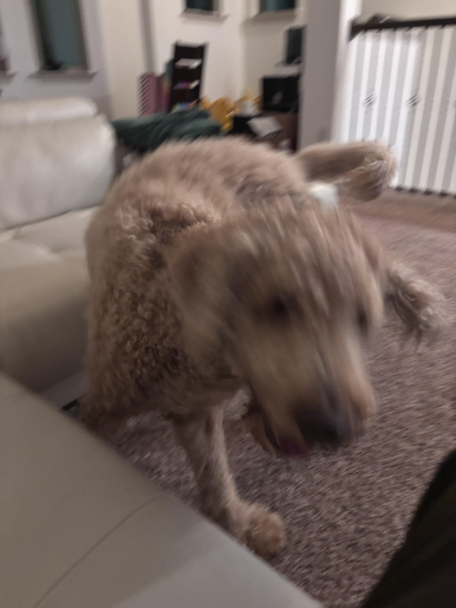
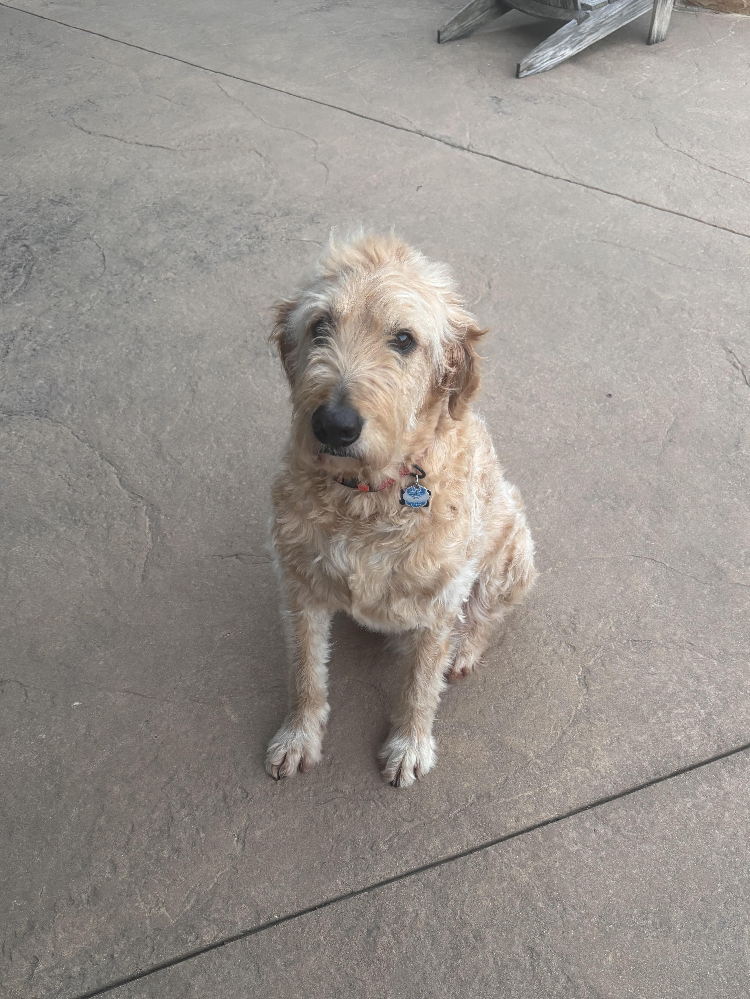

Hi, I'm Ben! I'm studying aerospace engineering and physics at the University of Texas at Arlington, hoping to graduate in spring 2028. My primary interests are propulsion systems (especially for space applications!) and particle physics. I made this website to serve as a repository for all of my projects to share updates and go over them in more detail. Also, I made this website because it was really fun to do!

I enjoy reading, traveling, and tabletop board games. I love Its Always Sunny in Philadelphia and I have the cutest dogs:

<!--Preset Template Content Below (keeping for now as an example):
### My story
