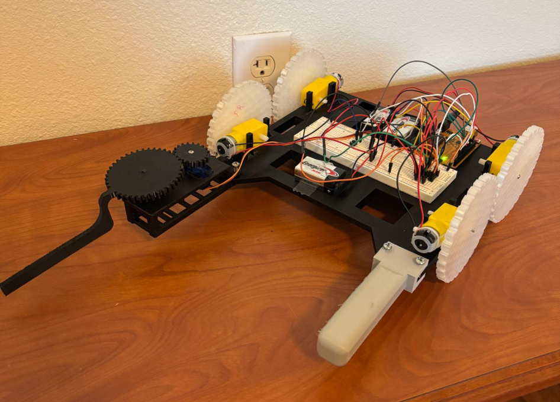
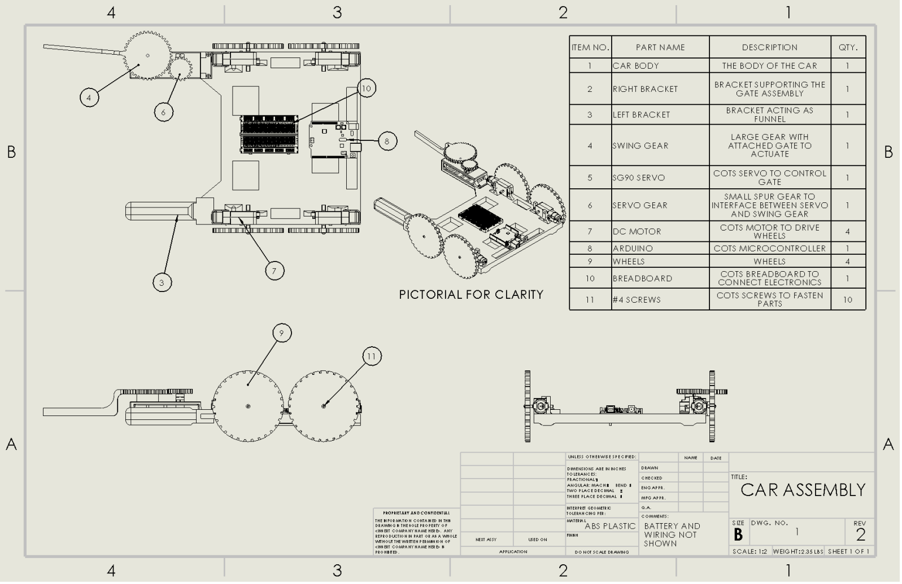
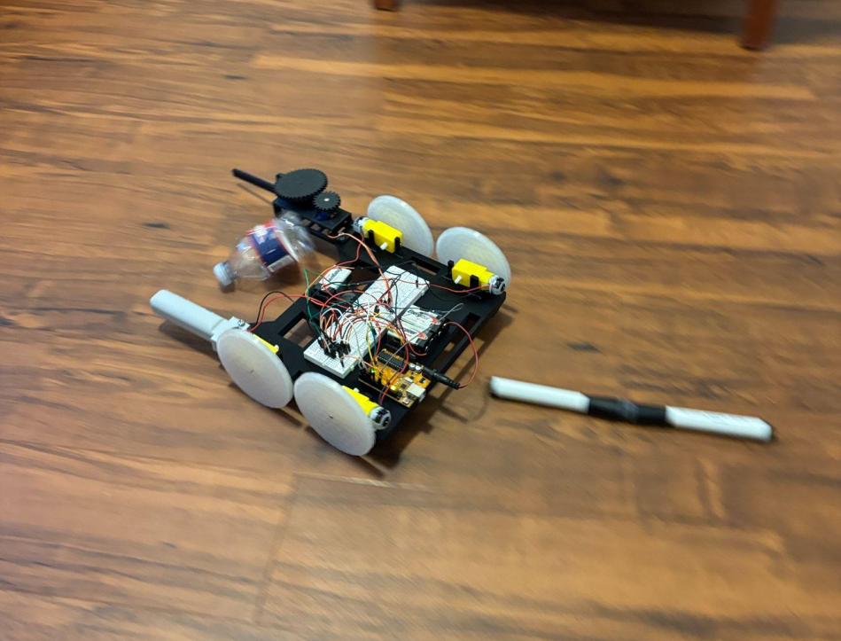

**Outline**

During my first semester at UTA I took an intro to engineering design class. As part of the course’s requirements, I was paired with a friend and tasked with designing a device to complete a design challenge. The challenge was to move, in less than a minute, three small empty water bottles across the floor past a finish line a few feet away. The finish line was blocked in front of the bottles by a wide wall, so they would need to be moved around or over it.  

There were two main problems: 1, the water bottles were empty and very light, and so could be tipped over quite easily. However, the water bottles needed to be freely standing at the end in order to score any points. And 2, we were not allowed to interact with the device at all during its operation, it had to be completely autonomous.

Our solution was to produce a custom, arduino controlled robot car!

**Broad Design**

The car overall was fairly simple, consisting of a 3d printed body which held the motors, batteries, and microcontroller hardware. The 3d printed body had several advantages, like being very easily manufactured.

 Additionally, we were able to design proper mounting hardware directly into the body. This was a huge lesson for me, and something I’ve tried to keep in future projects, that it is very easy to overlook how you’ll actually attach all your components to one another. CAD has the advantage of making this problem more obvious, because you can look around your parts from different angles and consider how they could effectively be mated, as well as test those mates as you digitally build your assembly.

The car body was the first part I’d ever 3D printed, and it shows in some obvious flaws like the unnecessarily large size of the body. It wasn’t exactly efficient in terms of plastic, however it did make it much easier to work with.

The other main subassembly was the funnel/gate attached to the front of the car. The idea was that this section, intentionally mounted low on the wheels, would push the water bottles around from a lower point along their side. This lower contact point would produce less of a tipping moment on the bottles as they were pushed. Additionally, the funnel had two protruding bars meant to keep the bottles contained as the car turned around any obstacles. The bar on the right was equipped with a servo-controlled swing gate that could close and keep the bottles in the funnel.

**Funnel Design Details**

The funnel design went through a few revisions during the project. Originally, we considered mounting the bars at an angle to make a “V” shape. The straight mounting orientation was chosen because, as the car turns in place, we worried the V shape would serve as a sort of ramp for the bottles to slide along out of the funnel. While the gate was added to prevent this, we wanted it to be a backup retaining feature, instead relying on the shape of the funnel naturally keeping the bottles with the car.

Speaking of the gate, this was another big learning moment for us! Firstly, the funnel bar on the right, which mounts the servo and gate assembly, was pretty significantly over-engineered. I spent quite a while adding supports/fillets and testing its performance with FEA simulation. However, my simulations all involved pretty significant over-estimations of any kind of load the bar might expect to see in use. The lesson learned here: simulations are pointless without first developing realistic loading expectations. Later projects have had a lot more emphasis on understanding the stresses my parts will experience before worrying about simulating their performance under those stresses.

Ironically, my pessimism about the loads the bar would experience was balanced with my optimism on the loading the gate itself would experience. I ran simulations on the gate with a 1.5lb distributed load across the inside edge. I recognized even then that this was a very conservative estimate of what kind of load the gate would feel just holding a few ounces worth of plastic bottles back. So where’s the optimism?

I never considered loads the gate might experience during a crash. However, after a minor code mistake sent the car at full speed directly into a wall, that is exactly what happened. The night before the robot was meant to be presented for something like half our grade in that class, it went all fast and furious right into a wall in the student center. The gate, which was in the forward/open position during the crash, took the brunt of the impact and snapped off.

To be completely honest, it could’ve been worse. The gate and overengineered right bar absorbed the impact and the car was otherwise fine. Also, I was at least a little proud to see our creation go so FAST before it crashed.

In the end, our funnel design was sufficient to hold the water bottles and successfully present the next day without a functioning gate mechanism!

**Conclusion**

This project will always have a special place in my heart (and a dedicated space in my closet). It was my first exposure to a higher level engineering project, and I learned a LOT of stuff about the project management/responsibility side of things beyond the technical parts. 

The lessons I learned on this project served me well in future projects, for example the stuff about having very intentional design when it comes to mounting hardware.

