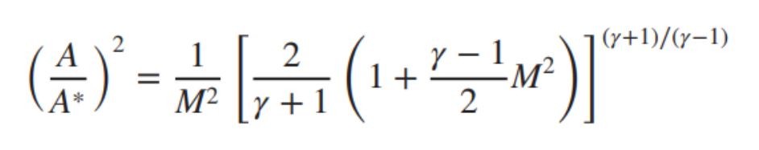
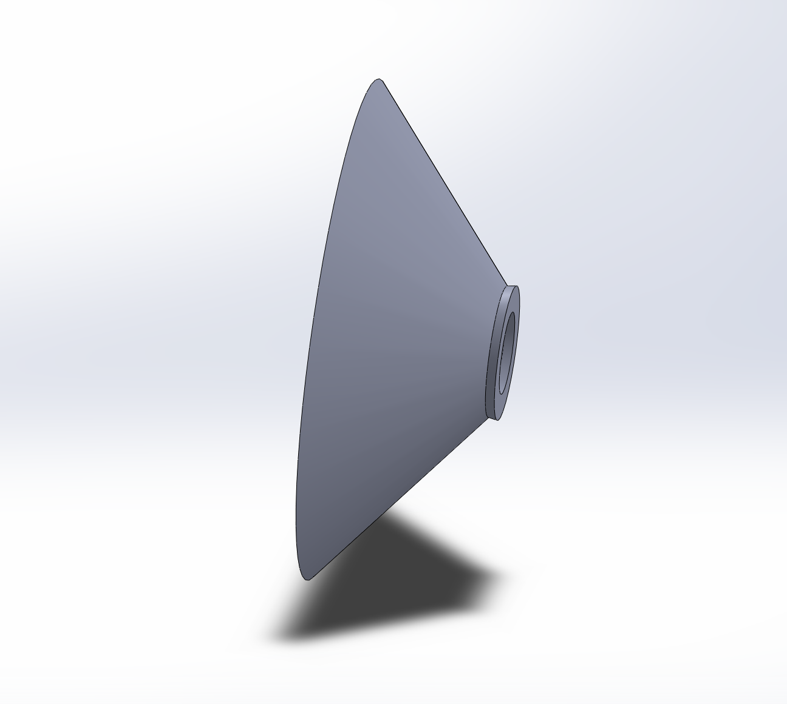

**Project Origin and Outline**

 This one is a pretty new/ WIP project. While sitting in my compressible fluids class I was wondering what a thruster of my own design could look like. Inspired by the cold gas thrusters used in attitude control on satellites, I imagined my own cold gas thruster. I could feed a 3D printed nozzle through a pressurized gas tank, maybe I could control the gas flow with some kind of electric regulator in order to get a variable thrust output. Maybe I could even connect that thruster to some kind of rotating moment arm and use a PID system to control the thrust and balance the moment arm at varying angles?

 Thus started my latest project: to produce a pressure fed gas thruster with varying thrust capable of tuneable electronic control. Then, I could combine that thruster with some kind of balancing system and a PID controller to balance it!

**Broad Design**

 Pretty early on in my conceptual design phase I ruled out using an actual pressurized tank to supply the gas. A tank with sufficient volume would be heavy, expensive, and inconvenient to refill. Instead my current plan is to use an air compressor to feed a consistent line of pressure to the nozzle for as long as I want.
Speaking of the nozzle, this part of the design has been pretty interesting. I skipped to the supersonic nozzle design chapter in my compressible flow textbook to learn more about how they work. I found some good stuff, like the following equation: 

 This equation is the area-mach relation, and it can be used to find the flow velocity (in terms of mach number) at any point in a nozzle by comparing the area at that point to the area at the throat of the nozzle. Based off the thrust equation (*thrust = mass flow rate * exit velocity*) it can be seen that a thruster’s thrust is higher the higher the exit velocity. So to maximize my nozzle’s thrust I need to maximize the exit mach number, and therefore by the area-mach relation I need to maximize the exit area. (there's actually a bit more to this, but for now its good)

 In general, supersonic thrusters use a convergent-divergent or “de Laval” style nozzle. These have a convergent section, where the flow is forced into a smaller area. This speeds up the subsonic gas in the area upstream of the throat. Eventually, the gas speeds up to the speed of sound, mach one. This happens at the point along the nozzle with the smallest area, the throat. 

 Interesting aside: the flow at the nozzle actually becomes “choked”, such that the mass flow rate is constant. Because the velocity and area at the throat are fixed, the only way to change the mass flow rate is by changing the upstream pressure/temperature to change the density of air fed through the throat. This is valuable for thrust calculations because it means that, regardless of what happens downstream of the throat (for example the exit pressure of the nozzle), the mass flow rate is constant. Given that thrust is directly tied to mass flow rate, this is a pretty key finding.

 After the flow reaches a sonic, or “critical”, condition at the throat it continues to accelerate as it goes through the next section of the nozzle. Interestingly, for supersonic gas flows the standard logic of smaller area = faster flow inverts, and the flow actually speeds up the larger the nozzle’s area. It is this behavior that results in the classic converging-to-diverging “bell” shaped nozzle on rocket motors.

**Thrust Control**

 After finishing preliminary sizing and concepting, I determined that the thrust on a cheaper compressor was not going to be high enough for my full project. I calculated that in ideal circumstances, I could produce about 0.335N of thrust from a standard hobby-grade air compressor (the kind used to power airbrushes).
 
 However, I also decided that it would be a good idea to start with a smaller scale prototype in order to test some key features. Importantly, I want to use a custom force measuring rig to verify the thrust predictions.
 
 Additionally, a key part of this project is accurate thrust *control*, which I currently have two concepts for. The thrust produced by a pressure fed nozzle depends, predictably, on the pressure of gas fed into it (specifically in comparison to the pressure at the exit). As such, if I were to electronically control the pressure of the regulator between the compressor and nozzle, I should be able to scale the thrust up or down as needed using a microcontroller to respond to the balancing system’s inputs. However, I was not able to find any affordable electrically varying gas regulators. What I COULD find however, was electric solenoids! These allow me to simply turn on or off the flow, and so my hope is that by doing that in rapid succession I could reduce the thrust through a sort of varying “duty cycle”. This is essentially like how pulse width modulation is used to control the intensity of LEDs. However, fluid systems do not react *nearly* as fast as electric ones, and so I fear the flow wouldn’t be able to react fast enough. This is compounded by the likelihood of significant turbulent effects making flow unpredictable and the solenoid itself potentially having a switching frequency that is too low.

 My other solution is to mount the thruster with a servo, allowing it to rotate 90* from perpendicular to parallel to the surface its mounted on. Since most of my PID balancing system ideas involve controlling the rotation of some lever arm, changing the thrust’s angle with respect to that arm is sufficient to control the arm. This is because changing the angle from directly perpendicular will reduce the moment imparted by the thruster on the arm, and therefore will reduce the amount its tending to rotate. This solution has potential problems too, for example the moment imparted on the balancing arm system by the servo itself could be problematic. However, it is simpler from a fluids perspective, and I am excited to try it out!

**Nozzle Design**

With all the preliminary design out of the way, I moved on to selecting the specific compressor I would use for my prototype. I found an affordable compressor on sale that could produce a consistent 3.1 bar, which my calculations indicated should allow a max thrust of about 0.6N with the right nozzle. I set about designing the nozzle, using the equations from my textbook (like the mach-area relation) to determine the required throat and exit radii (with the mouth radius determined by the compressor’s hose diameter). I connected these radii with a slope of about 12 degrees in the divergent section and 45 degrees in the convergent section, which were recommended to reduce turbulent effects inside the nozzle. Future designs could apply the method of characteristics to properly adjust the internal slope of the nozzle and avoid any kind of shock waves, but for a prototype those values would work.

I designed my nozzle in Solidworks, and it ended up looking a little strange.

Realistically I think the reason it looks so strange is that the hose diameter is so much larger than the required critical area at the throat. This means that the convergent section is MUCH larger than the divergent section. Overall, I’m quite excited to print and use the nozzle! I purchased some brass pipe fittings I’ll be using to mount the nozzle to the hose. The hope is to heat the brass fittings like heated brass inserts, then melt them into an extra back section of space on the nozzle which I’ll be adding soon. This should provide an airtight fit!

**Next Steps**

There is a lot of work yet to do on this project, however I am very excited to get it all done! Here’s hoping exam season doesn’t take *too* much time so I can keep this project in motion through November.
